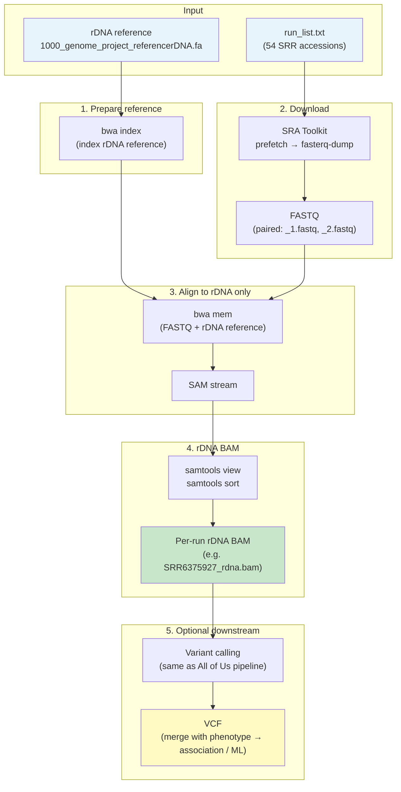

# rDNA extraction pipeline — flowchart

Flow of the pipeline: from SRA run list to rDNA-mapping BAMs (and optional variant calling).

---

## Flowchart (Mermaid)

---

## Flow in short

| Step | What happens |
|------|----------------|
| **Input** | `run_list.txt` (SRR IDs) + rDNA reference FASTA. |
| **1** | Index the rDNA reference with BWA (once). |
| **2** | For each SRR: SRA Toolkit → download FASTQ. |
| **3** | Align FASTQ to rDNA reference only (BWA MEM) → SAM. |
| **4** | Convert SAM to sorted BAM → **one rDNA BAM per run** (these are “sequences mapping to the rDNA”). |
| **5** | (Optional) Variant calling on rDNA BAMs → VCF → merge with phenotype for association/ML. |

---

## One-line summary

**run_list.txt → download FASTQ → align to rDNA reference → rDNA BAM (and optionally VCF).**
