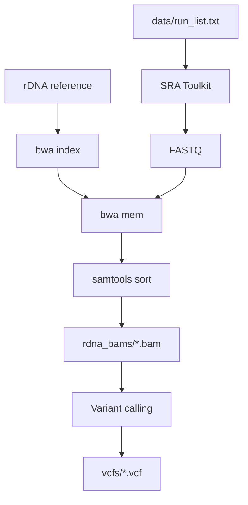

# Pipeline

Flow: `data/run_list.txt` and rDNA reference → SRA Toolkit → FASTQ → BWA to rDNA → one rDNA BAM per run; optionally variant calling → VCF.

## Flowchart

## Steps

| Step | Action |
|------|--------|
| 1 | Index rDNA reference: `bwa index 1000_genome_project_referencerDNA.fa` |
| 2 | For each SRR: download FASTQ via `fasterq-dump` (or `fastq-dump`) |
| 3 | Align FASTQ to rDNA reference only (BWA MEM) → SAM |
| 4 | Sort and index → one rDNA BAM per run in `rdna_bams/` |
| 5 | (Optional) Variant calling on BAMs → VCF in `vcfs/` |

Scripts: `scripts/download_and_extract_rdna.sh` (steps 1–4), `scripts/variant_calling.sh` (step 5), `scripts/run_pipeline.sh` (runs both). Run from the study root (`SRP126734_schizophrenia_rDNA/`). Paths to `data/run_list.txt` and output dirs are set inside the scripts.

## Prerequisites

- SRA Toolkit (fasterq-dump or fastq-dump)
- BWA, samtools
- rDNA reference: `1000_genome_project_referencerDNA.fa` (obtain from collaborators; place in study root or set `RDNA_REF`)

## Pilot downloads (subset of reads)

Set `FASTQ_MAX_SPOTS` (e.g. `20000`) when calling `download_and_extract_rdna.sh`. The script runs **`fastq-dump -X`** for that case, because **`fasterq-dump` does not support `--maxSpotId`**. **Not for production**; full WGS needs all spots and uses `fasterq-dump` without `-X`.

## If `fasterq-dump` says “Failed to call external services”

This is **not** an HPC issue; the download step never started correctly.

Try, in order:

1. **`conda deactivate`** then run again (conda’s `fasterq-dump` sometimes conflicts with Homebrew’s).
2. **Force Homebrew binaries:**  
   `export FASTERQ_DUMP=/opt/homebrew/bin/fasterq-dump`  
   `export PREFETCH=/opt/homebrew/bin/prefetch`
3. **`vdb-config --interactive`** once, accept defaults / remote access.
4. **`USE_PREFETCH=true`** — downloads the `.sra` with `prefetch` into `sra_cache/`, then runs `fasterq-dump` on the **local file** (works when direct streaming fails). **Warning:** one WGS run can be **many GB**.

Also update SRA Toolkit (`brew upgrade sra-tools`) and retry on a network that allows NCBI.

## Relation to All of Us

All of Us: CRAM → FASTQ → align to same rDNA reference → variant calling → VCF. Here: SRA (FASTQ) → same alignment and optional variant calling. Downstream: phenotype + rDNA variants → burden/association and ML.
