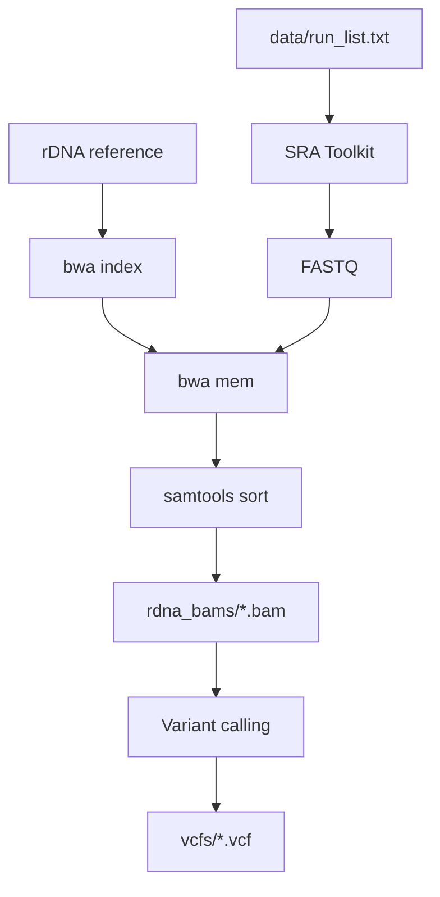

# Pipeline

Flow: `data/run_list.txt` and rDNA reference → SRA Toolkit → FASTQ → BWA to rDNA → one rDNA BAM per run; optionally variant calling → VCF.

## Flowchart

## Steps

| Step | Action |
|------|--------|
| 1 | Index rDNA reference: `bwa index 1000_genome_project_referencerDNA.fa` |
| 2 | For each SRR: download FASTQ via `fasterq-dump` (or `fastq-dump`) |
| 3 | Align FASTQ to rDNA reference only (BWA MEM) → SAM |
| 4 | Sort and index → one rDNA BAM per run in `rdna_bams/` |
| 5 | (Optional) Variant calling on BAMs → VCF in `vcfs/` |

Scripts: `scripts/download_and_extract_rdna.sh` (steps 1–4), `scripts/variant_calling.sh` (step 5), `scripts/run_pipeline.sh` (runs both). Run from the study root (`SRP126734_schizophrenia_rDNA/`). Paths to `data/run_list.txt` and output dirs are set inside the scripts.

## Prerequisites

- SRA Toolkit (fasterq-dump or fastq-dump)
- BWA, samtools
- rDNA reference: `1000_genome_project_referencerDNA.fa` (obtain from collaborators; place in study root or set `RDNA_REF`)

## Relation to All of Us

All of Us: CRAM → FASTQ → align to same rDNA reference → variant calling → VCF. Here: SRA (FASTQ) → same alignment and optional variant calling. Downstream: phenotype + rDNA variants → burden/association and ML.
